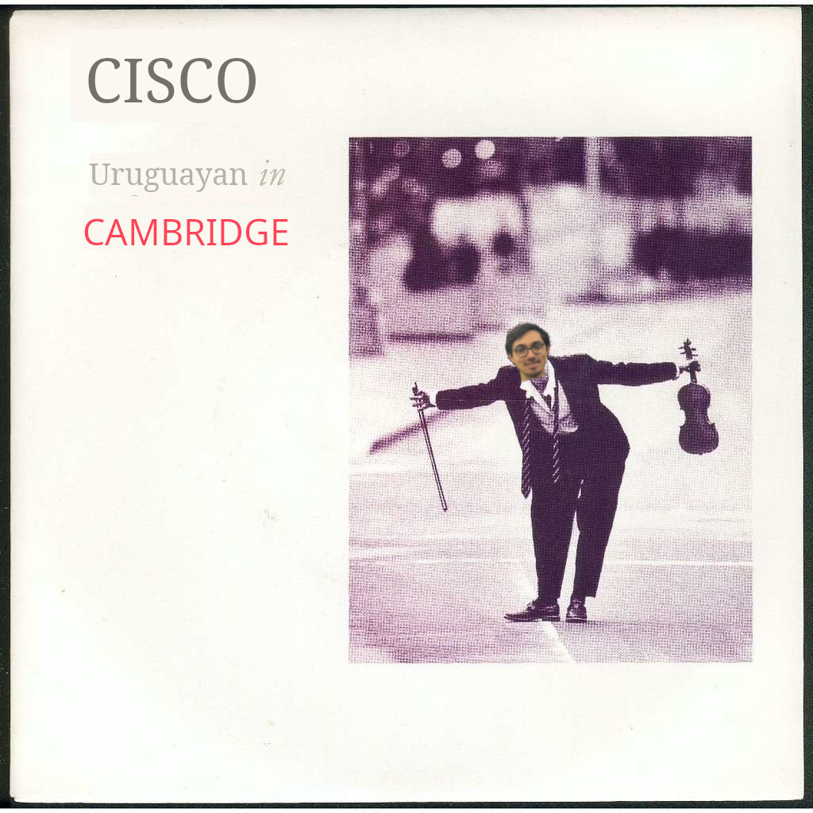
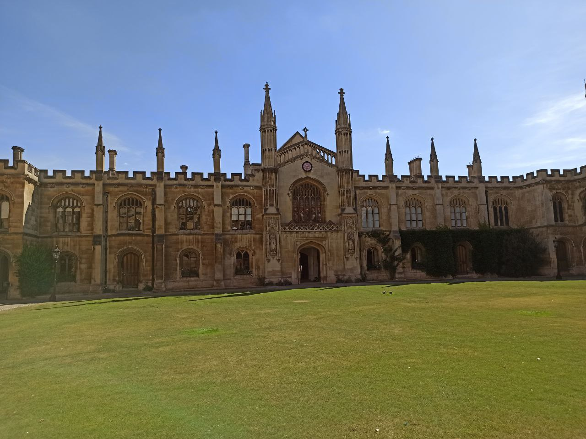
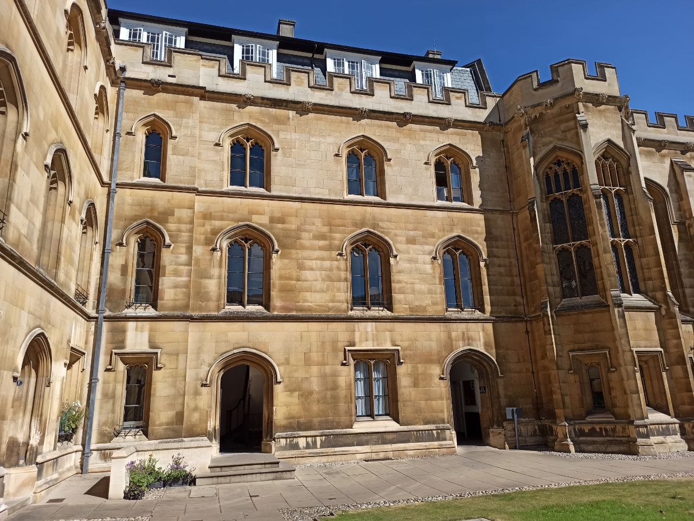
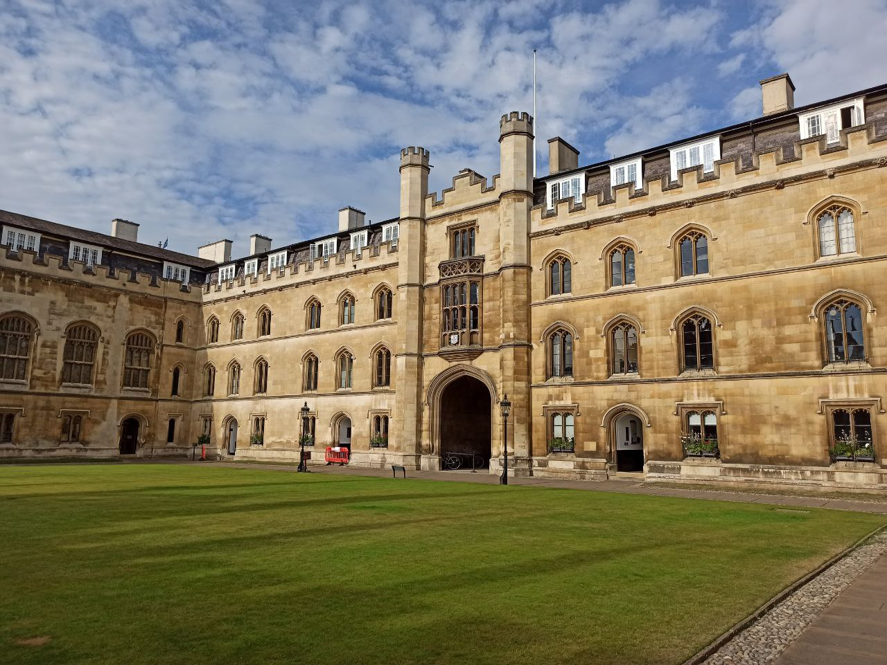
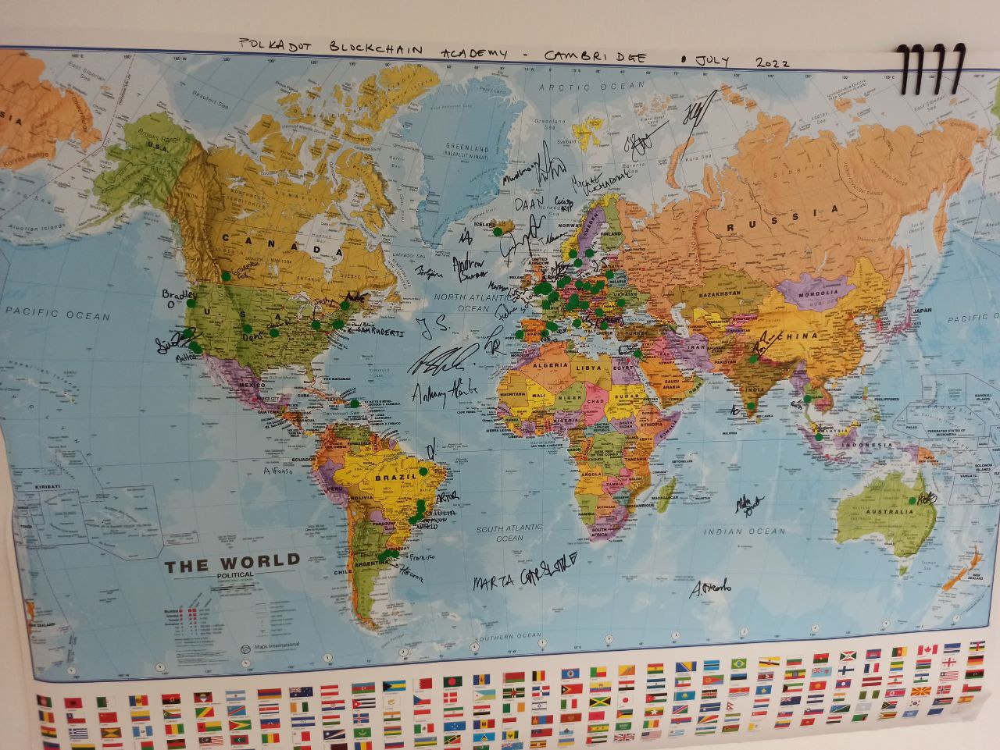
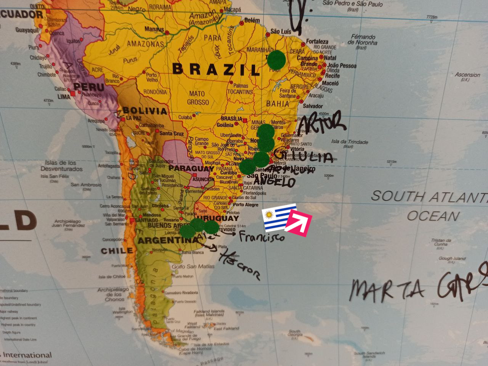
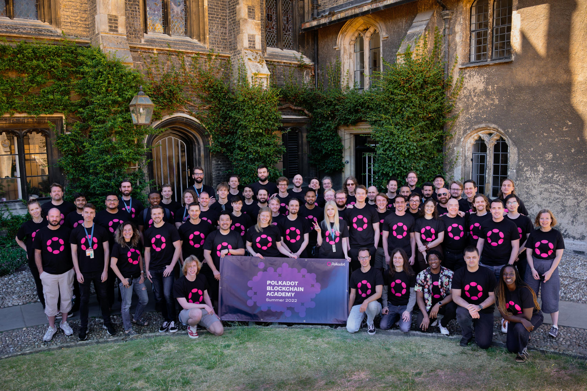
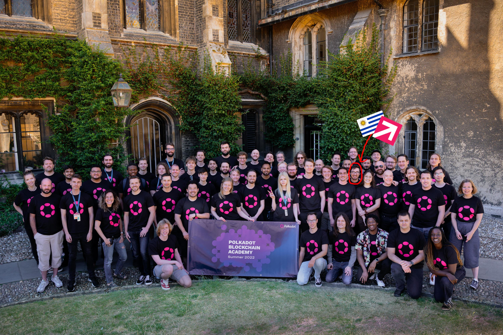

<!-- .slide: data-background="./theme/intro.png" -->

# Polkadot Blockchain Academy

Note:
Para los que no saben, el mes pasado fui a la primer edición
de la Polkadot Blockchain Academy.
Esta lightning es para contarles lo que es y por qué fui,
contarles la experiencia y que me puedan preguntar
cualquier cosa que se les ocurra.

----

<!-- .slide: data-background="./theme/intro.png" -->

---

<!-- .slide: data-background="./theme/subsection_pink.jpg" -->

# ¿Qué?

Note:
Ya muchos han oido hablar de Blockchain, algunos a la pasada,
otros entienden al detalle lo que son.
Esta academia fue la primera de este estilo que se ha hecho.
Enseña tanto los fundamentos de Blockchain como Polkadot y Substrate
(herramientas específicas).

----

<!-- .slide: data-background="./theme/blank_with_logo_pink.png" -->

Note:
Polkadot es una Blockchain creada por uno de los cofundadores de Ethereum, Gavin Wood.
Apunta a solucionar el problema de escalabilidad e interoperabilidad entre Blockchains.
Para hacer esto, tiene un sistema con una relay chain y muchas parachains que se comunican
entre si mediante XCM (un formato de mensajería entre sistemas de consenso que ellos crearon).

----

<!-- .slide: data-background="./theme/blank_with_logo_pink.png" -->

Note:
Framework para crear blockchains, escrita en Rust.
Permite crear tanto solochains como parachains para Polkadot.
Dispone de un sistema modular de "pallets" que permiten muy rapidamente
armar una chain con todas las features que uno esperaría hoy en día
(balances, governanza, smart contracts, etc).

---

<!-- .slide: data-background="./theme/subsection_pink.jpg" -->

# ¿Dónde?

Note:
Esta primer cohorte fue en Cambridge, Inglaterra, en el Corpus Christi College.
Van a hacer futuras ediciones en distintos lugares, una en Asia y una en Sudamérica.
Si esto es algo que les interesa pueden anotarse a las siguientes cohortes.

----

<!-- .slide: data-background="./theme/blank_with_logo_pink.png" -->

  

    
    
  

  

---

<!-- .slide: data-background="./theme/subsection_pink.jpg" -->

# ¿Quienes?

Note:
Fue gente de todo el mundo.

----

<!-- .slide: data-background="./theme/blank_with_logo_pink.png" -->

Note:
La mayoría de la gente fue de europa.
Habían bastantes estadounidenses.
Fueron 5 brasileros, 2 argentinos y 1 uruguayo.

----

<!-- .slide: data-background="./theme/blank_with_logo_pink.png" -->

Note:
Dejé constancia de que el paisito estuvo presente.

----

<!-- .slide: data-background="./theme/blank_with_logo_pink.png" -->

Note:
Esta foto la sacamos al final con la camiseta de Polkadot.
Eran alrededor de 50 estudiantes.

----

<!-- .slide: data-background="./theme/blank_with_logo_pink.png" -->

Note:
Y ahí estoy yo.

---

<!-- .slide: data-background="./theme/subsection_pink.jpg" -->

# ¿Por qué?

Note:
Para aprender más sobre Polkadot y Substrate.
Desde hace meses que empezamos con Barreto a investigar Blockchain
y el proyecto que más me interesó fue Polkadot (obviamente porque está hecho en Rust).

---

<!-- .slide: data-background="./theme/subsection_pink.jpg" -->

# Temario

----

<!-- .slide: data-background="./theme/blank_with_logo_pink.png" -->

## Fundamentos

- Criptografía
- Economía
- Blockchain y consenso

Note:
Enseñaron los fundamentos, que son independientes de la tecnología de ellos.

----

<!-- .slide: data-background="./theme/blank_with_logo_pink.png" -->

## Tecnología

- Substrate
- Polkadot
- FRAME
- XCM

Note:
Luego aprendimos cómo funciona Polkadot y programamos en Substrate.

---

<!-- .slide: data-background="./theme/subsection_pink.jpg" -->

# Next steps

----

<!-- .slide: data-background="./theme/blank_with_logo_pink.png" -->

## Substrate workshop

Fecha TBD

Note:
La fecha todavía no está definida pero va a ser las primeras semanas de setiembre.
Va a tener el mismo módulo de fundamentos que la academia así que las primeras clases
no son solo para programadores.
Va a ser abierto a todo público de manera remota así que si conocen a alguien que
le interese blockchain diganle.

---

<!-- .slide: data-background="./theme/subsection_pink.jpg" -->

# Preguntas

---

<!-- .slide: data-background="./theme/subsection_pink.jpg" -->

# Gracias!
