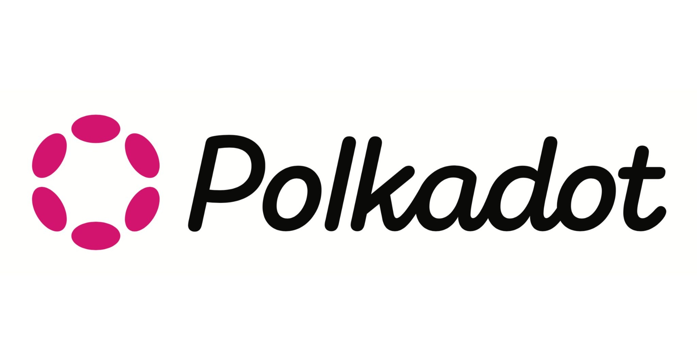
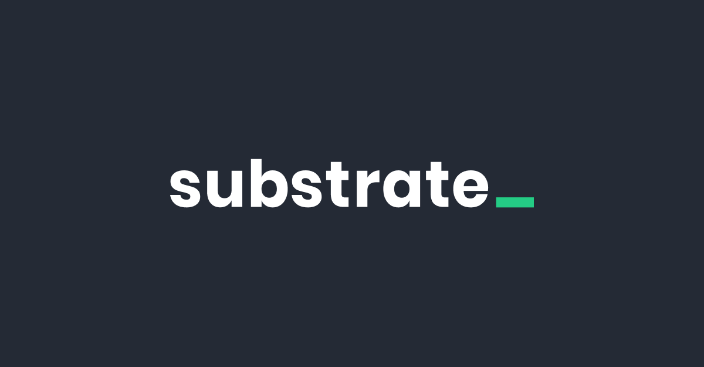

<!-- .slide: data-background="./theme/intro.png" -->

# Polkadot Blockchain Academy <!-- .element: style="color: black;" -->

Note:
Para los que no saben, el mes pasado fui a la primer edición
de la Polkadot Blockchain Academy.
Esta lightning es para contarles lo que es y por qué fui,
contarles la experiencia y que me puedan preguntar
cualquier cosa que se les ocurra.

----

<!-- .slide: data-background="./theme/intro.png" -->

---

<!-- .slide: data-background="./theme/subsection_pink.jpg" -->

# ¿Qué?

Note:
Ya muchos han oido hablar de Blockchain, algunos a la pasada,
otros entienden al detalle lo que son.
Esta academia fue la primera de este estilo que se ha hecho.
Enseña tanto los fundamentos de Blockchain como Polkadot y Substrate
(herramientas específicas).

----

<!-- .slide: data-background="./theme/blank_with_logo_pink.png" style="color: black;" -->

## Blockchain <!-- .element: style="color: black;" -->

- Máquina de estados replicada distribuida
- Consenso
- Casos de uso: servicios financieros, governanza, cloud computing, etc

Note:
Voy a repasar de manera breve lo que es una blockchain.
Las blockchains son máquinas de estados replicadas distribuidas.
Cada computadora corriendo el programa de la blockchain es un nodo.
Muchos nodos forman parte de la red de la blockchain.
Cada nodo corre una máquina de estados.
Los nodos deben ponerse de acuerdo (llegar a consenso) en cuál es
la transición que van a hacer, y la hacen todos al mismo tiempo.
Si la mayoría (supermayoría) de los nodos actúan de manera honesta
(no se desvían del protocolo) entonces siempre habrá solo un estado
actual.
Todos los nodos verifican el trabajo (las transiciones) de todos los
otros nodos.
Esto permite casos de uso como transacciones financieras.
Todos (en realidad algunos) validan todas las transacciones en vez de que
una entidad centralizada lo haga.

----

<!-- .slide: data-background="./theme/blank_with_logo_pink.png" style="color: black;" -->

## Historia <!-- .element: style="color: black;" -->

- Bitcoin en 2009
- Ethereum en 2015
- Polkadot en 2020

Note:
El uso de bitcoin fue puramente intercambio de tokens, "a peer-to-peer electronic cash system".
Ethereum le agregó la idea de funciones de transición programables a la máquina de estados
(smart contracts) lo cual abrió la puerta para muchos nuevos casos de uso (governanza por ejemplo).
Polkadot fue creado con una filosofía distinta, apuntando al concepto de Web3.

----

<!-- .slide: data-background="./theme/blank_with_logo_pink.png" style="color: black;" -->

## Web3? <!-- .element: style="color: black;" -->

> "BitTorrent was the first Web3 application" - Gavin Wood

Note:
Seguramente ya hayan escuchado hablar de web3.
Seguramente también, muchos de ustedes piensen que son solo NFTs o que es una estafa.
Una web en la que no hay que confiar ciegamente en service providers gigantes como Google y Amazon.
Basada en tecnologías peer-to-peer y sistemas decentralizados.
Busca que los usuarios sean dueños de sus datos y que las empresas se los compren a ellos,
en vez de que los usuarios les den sus datos ciegamente a las empresas y estas los vendan sin
el consentimiento de los usuarios.
Todavía está en pañales.

----

<!-- .slide: data-background="./theme/blank_with_logo_pink.png" style="color: black;" -->

## Parity y Web3 foundation <!-- .element: style="color: black;" -->

- Fundadas por Gavin Wood
- Parity creó Polkadot y Kusama
- La Web3 foundation investiga tecnologías y crea estándares para la Web3

Note:
La Web3 foundation tiene pila de investigadores, matemáticos, criptógrafos, economistas,
todos trabajando para crear estándares para poder hacer más privada nuestra comunicación
con la web.

----

<!-- .slide: data-background="./theme/blank_with_logo_pink.png" -->

Note:
Polkadot es una Blockchain creada para solucionar los problemas de escalabilidad
e interoperabilidad entre Blockchains.
Para hacer esto, tiene un sistema con una relay chain y muchas parachains que se comunican
entre si mediante XCM (un formato de mensajería entre sistemas de consenso que ellos crearon).

----

<!-- .slide: data-background="./theme/blank_with_logo_pink.png" -->

----

<!-- .slide: data-background="./theme/blank_with_logo_pink.png" -->

Note:
Framework para crear blockchains, escrita en Rust.
Permite crear tanto solochains como parachains para Polkadot.
Dispone de un sistema modular de "pallets" que permiten muy rapidamente
armar una chain con todas las features que uno esperaría hoy en día
(balances, governanza, smart contracts, etc).

----

<!-- .slide: data-background="./theme/blank_with_logo_pink.png" -->

## Why rust? <!-- .element: style="color: black;" -->

[Parity: Why Rust](https://www.parity.io/blog/why-rust)

Note:
Es seguro, es rápido, es poderoso y es divertido :)

----

<!-- .slide: data-background="./theme/blank_with_logo_pink.png" -->

Note:
Esta fue la relación con mi novia por un mes.

---

<!-- .slide: data-background="./theme/subsection_pink.jpg" -->

# ¿Dónde?

Note:
Esta primer cohorte fue en Cambridge, Inglaterra, en el Corpus Christi College.
Van a hacer futuras ediciones en distintos lugares, una en Asia y una en Sudamérica.
Si esto es algo que les interesa pueden anotarse a las siguientes cohortes.

----

<!-- .slide: data-background="./theme/blank_with_logo_pink.png" -->

  

    
    
  

  

----

<!-- .slide: data-background="./theme/blank_with_logo_pink.png" -->

Note:
Agradezco a todo el equipo de Tastemade por bancar que me fuera y apagar los fuegos.

---

<!-- .slide: data-background="./theme/subsection_pink.jpg" -->

# ¿Quienes?

Note:
Fue gente de todo el mundo.

----

<!-- .slide: data-background="./theme/blank_with_logo_pink.png" -->

Note:
La mayoría de la gente fue de europa.
Habían bastantes estadounidenses.
Fueron 5 brasileros, 2 argentinos y 1 uruguayo.

----

<!-- .slide: data-background="./theme/blank_with_logo_pink.png" -->

Note:
Dejé constancia de que el paisito estuvo presente.

----

<!-- .slide: data-background="./theme/blank_with_logo_pink.png" -->

Note:
Esta foto la sacamos al final con la camiseta de Polkadot.
Eran alrededor de 50 estudiantes.

----

<!-- .slide: data-background="./theme/blank_with_logo_pink.png" -->

Note:
Y ahí estoy yo.
Conocí a la gente que trabaja en Parity y en la Web3 foundation e hice
muchos amigos de distintos paises.

---

<!-- .slide: data-background="./theme/subsection_pink.jpg" -->

# ¿Por qué?

Note:
Para aprender más sobre Polkadot y Substrate.
Desde hace meses que empezamos con Barreto a investigar Blockchain
y el proyecto que más me interesó fue Polkadot (obviamente porque está hecho en Rust).

----

<!-- .slide: data-background="./theme/blank_with_logo_pink.png" style="color: black;" -->

---

<!-- .slide: data-background="./theme/subsection_pink.jpg" -->

# Temario

----

<!-- .slide: data-background="./theme/blank_with_logo_pink.png" style="color: black;" -->

## Fundamentos <!-- .element: style="color: black;" -->

- Criptografía
- Economía
- Blockchain y consenso

Note:
Enseñaron los fundamentos, que son independientes de la tecnología de ellos.

----

<!-- .slide: data-background="./theme/blank_with_logo_pink.png" style="color: black;" -->

## Tecnología <!-- .element: style="color: black;" -->

- Substrate
- Polkadot
- FRAME
- XCM

Note:
Luego aprendimos cómo funciona Polkadot y programamos en Substrate.

---

<!-- .slide: data-background="./theme/subsection_pink.jpg" -->

# ¿Qué aprendí?

Note:
No sabía casi nada de blockchain antes de ir a la academia.
Así que, ¿qué aprendí?

----

<!-- .slide: data-background="./theme/blank_with_logo_pink.png" style="color: black;" -->

Note:
Aprendí que es todo NFTs.
Na, mentira.

----

<!-- .slide: data-background="./theme/blank_with_logo_pink.png" style="color: black;" -->

- Los fundamentos computacionales pero también económicos de blockchain
- Criptografía exótica: Zero-knowledge proofs, homomorphic encryption
- Cómo usar Substrate para construir chains
- Lo que la gente que está trabajando en Web3 piensa de ella

Note:
Al final del mes, estabamos con un grupo de estudiantes de la academia y se nos
acercó un ethereum core developer que no sabía mucho de polkadot y nada de la academia.
Me hizo preguntas acerca de Polkadot vs Cosmos, Polkadot vs Ethereum, cómo funciona XCM.
Pude responderlas todas y fue un momento de darme cuenta de todo lo que aprendí en el viaje,
antes no podría haber respondido ninguna.

---

<!-- .slide: data-background="./theme/subsection_pink.jpg" -->

# Next steps

----

<!-- .slide: data-background="./theme/blank_with_logo_pink.png" style="color: black;" -->

## Substrate workshop <!-- .element: style="color: black;" -->

Fecha TBD

Note:
La fecha todavía no está definida.
Va a tener el mismo módulo de fundamentos que la academia así que las primeras clases
no son solo para programadores.
Va a ser abierto a todo público de manera remota así que si conocen a alguien que
le interese blockchain diganle.
Puede ser que la hagamos un meetup para fomentar la comunidad de Polkadot en Uruguay.

---

<!-- .slide: data-background="./theme/subsection_pink.jpg" -->

# Preguntas

---

<!-- .slide: data-background="./theme/subsection_pink.jpg" -->

# Gracias!
